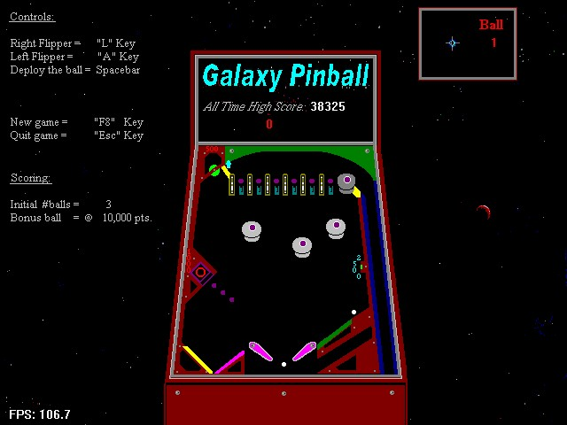



## Pinball in DirectDraw

### Description

This is my first attempt at writing a Pinball game in VB. It's just a demo. Please excuse the ugly graphics, I had to draw the main screen in 16 colors to make the file small enough to upload. You'll see the use of Sprites and a color Point collision detection method for ball movement. The "All Time High Score" is posted on the machine. I had fun making this, hope it will give someone a neat idea. You need DX7.
 
### More Info
 

             |
---                |---
**Submitted On**   |2001-01-23 12:21:50
**By**             |[Chris Seelbach](https://github.com/Planet-Source-Code/PSCIndex/blob/master/ByAuthor/chris-seelbach.md)
**Level**          |Advanced
**User Rating**    |3.4 (24 globes from 7 users)
**Compatibility**  |VB 6\.0
**Category**       |[Games](https://github.com/Planet-Source-Code/PSCIndex/blob/master/ByCategory/games__1-38.md)
**World**          |[Visual Basic](https://github.com/Planet-Source-Code/PSCIndex/blob/master/ByWorld/visual-basic.md)
**Archive File**   |[CODE\_UPLOAD140931232001\.zip](https://github.com/Planet-Source-Code/chris-seelbach-pinball-in-directdraw__1-14655/archive/master.zip)

